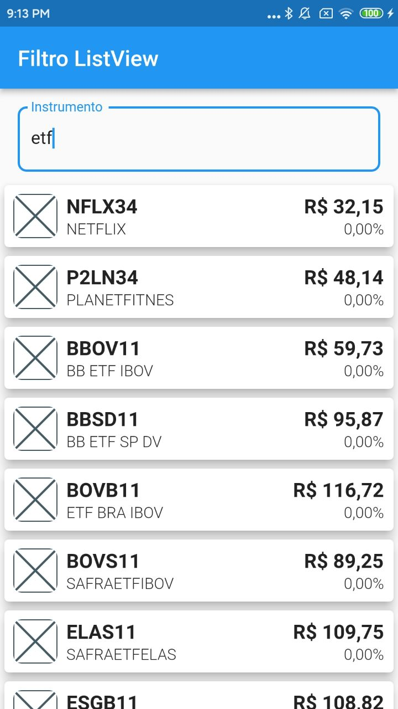
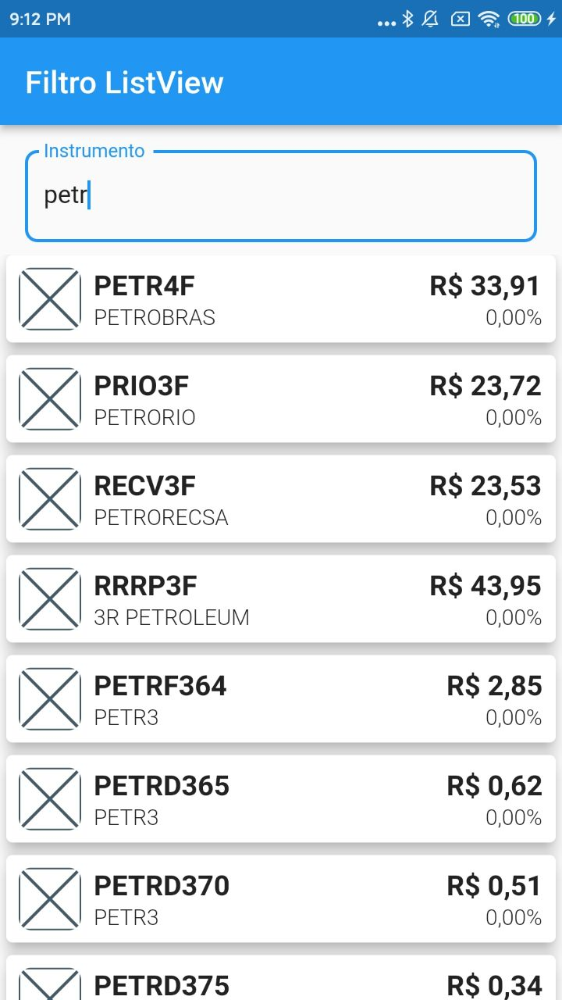
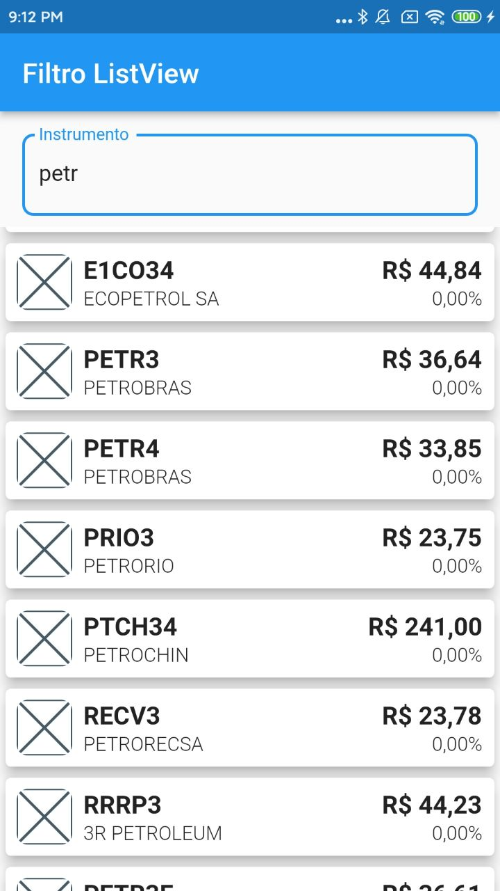
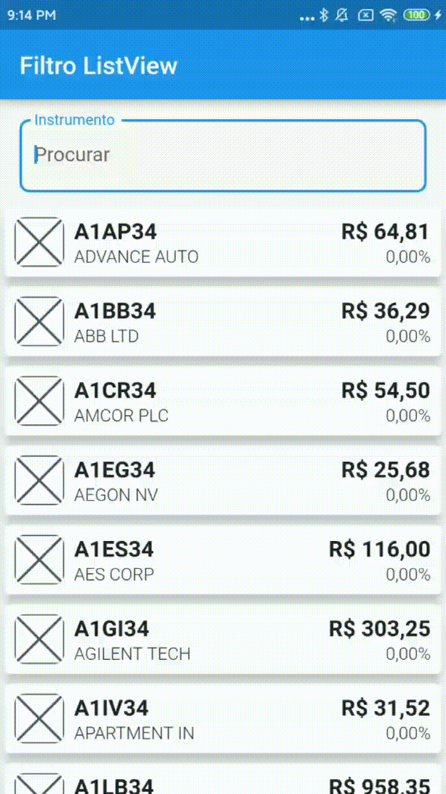

# ListView com filtro ao digitar

Exemplo de como aplicar filtros em uma ListView para ajudar o usuário a escolher
um item dentre uma lista com muitas opções.

## Prints

Algumas telas de exemplo com filtros já aplicados.

## GIF

Abaixo, um exemplo do filtro em ação.

